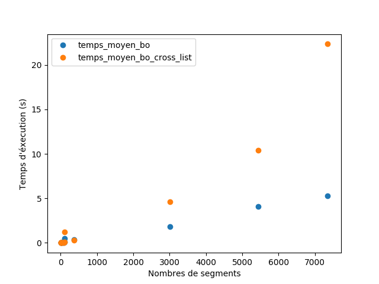

% Rapport de projet : Algorithme de Bentley-Ottmann
% Mathieu Barbe et Balthazar Potet
% 28/04/2017

# Introduction

Dans le but de détecter les intersections contenus dans un ensemble de segments, nous avons implémenté l'algorithme de Bentley-Ottmann à partir du langage de script Python.
Celui-ci fonctionne avec presque l'ensemble des fichiers de test fournis à l'exception de random_200.bo qui nous pose quelques soucis d'imprécision.
Nous avons fait l'effort de bien structurer notre programme ainsi que de commenter notre code dans l'objectif d'optimiser notre effort et vous faciliter la tâche si vous désirez étudier notre implémentation en détail.
Nous avons fait le choix d'énumérer seulement les intersections "réelles", c'est-à-dire que nous ne prenons pas en compte les intersections où une extrémité de segment intervient. Mais vous pourrez trouver dans le code la liste de tout les contacts entre segments si nécessaire.
Dans la suite de ce rapport, nous exposons le choix des structures de données, quelques points importants de notre implémentation, une études de l'éxécution de l'algorithme pour une optimisation et nous terminerons par des testes de performance.

# Structures de données

L'algorithme nécessite de manipuler trois types de données : les segments en vie, les événements à traiter et les intersections découverttes.
Le type de ces structures de données vont fortement influer sur la complexité de l'algorithme, et doivent donc être choisies avec soin.

## Liste des intersections

Le but de l'algorithme est de découvrir les intersections entre les segments, nous devrons donc les stoquer dans une liste, celle-ci sera également utile pour savoir si un croisement à déjà été trouvé dans le passé.
L'ordre des intersections trouvées n'a pas d'importance, cependant il est nécessaire de pouvoir vérifier rapidement la présence d'un élément.
C'est pourquoi une recherche efficace est nécessaire. 
Nous avons donc choisi d'utiliser une table de hachage, implémentée en python par le type set().

* Type python : set
* Nom de la variable : cross_set
* Nous avons également une liste alternative pour stoquer tout type de contact entre segments
* nom de la variable : cross_set_complet.
* Complexité des opérations qui nous consernes, moyenne, pire cas
    - x in set : O(1), O(n),
    - add : O(1)

## Liste des événements

Les événements représentent les étapes de l'algorithme, ils doivent être traités dans un ordre précis (selon leur position dans le plan et leur type). 
De plus, de nouveaux événements sont créés en cours d'exécution et doivent être ajoutés à la liste et automatiquement triés. 
Les événements seront traités dans l'ordre, nous n'avons donc besoin que de l'élément de plus grande priorité pour chaque étape .
Finalement, nous n'avons pas besoin de faire des recherches sur les événements présents dans la liste.

La liste de priorité ou tas, permet de faire chacune de ces opérations de manière efficace : insertion triée en O(log(n)) et suppression de l'élément de plus grande priorité en O(log(n)).

* Type python : heapq;
* Nom de la variable : events;
* complexité, pour un tas moyenne = pire cas : 
    - put : 0(log2(n)),
    - get : O(log2(n)).

## Liste des segments actifs

Les segments en vie à l'instant i où l'on traite l'événement eve_i sont les segments qui croisent la droite d'étude y = abscisse(eve_i).
Dans cette structure, les segments présents doivent être triés dans le but de les comparer avec leurs voisins. 
La difficulté réside dans le faite que pour un abscisse donné, l'ordre des segments peut-être différent, en revanche, entre deux événement triés, l'ordre ne doit pas varier.
On précise que pour chaque étape de l'algorithme, des segments peuvent être ajoutés, retirés ou intervertis.
Nous avons donc besoin de trouver rapidement la position d'un segment dans la structure de donnée. 

Un AVL permet de conserver la liste des éléments triée et réalise les opérations de base de manière efficace : insertion, recherche et suppression en O(log(n)).
En python, cette structure n'est pas très utilisée, en revanche, la SortedList, qui mixe une table de hachage et de simples listes triées est conseillée.
 Ça complexité est asymptotiquement identique mais la constante est un peu plus grande dans le cas de la SortedList

* Type python : SortedList
* Nom de la variable : alive_segments

La SortedList peut-être optimisée en précisant la taille de l'arbre avec le paramettre load.
En efet, pour que cette structure de donné soit eficace, la longueur des liste utilisées en interne doit-être égale à la racine cubique de n.
Nous avons pu lire qu'ils conseillent  de garder la valeur par défaut de 1000 qui fonctionne bien pour une taille allant de dix à dix millions d'élément.
Nous avons quand même effectué des testes sur ce paramètre sans observer de gain significatif.

# Implémentation

Pour implémenter l'algorithme, nous avons créé une class Bentley qui prend en paramètres un nom de fichier "bo" ou directement une liste de segments. 
Ce dernier paramètre nous aura permis d'isoler des erreurs et de les résoudres plus facilement. Voici les grandes étapes de notre implémentation :

1. Chargement des segments dans une liste à partir de la méthode 'load_segments' 
2. Création d'un couple d'événements, 'START' et 'END' pour chaque segment. Ceux-ci seront ajoutés au tas des événement 'events' qui s'occupera de les trier.
3. Boucle principale sur les événements 'START', 'CROSS' et 'END'
    * Pour chaque événement, on met à jour une variable globale 'eve' qui contient l'événement en cours. Cette technique nous sera indispensable pour ordonner les segments actifs entre eux.
    * On traite l'événement dans l'une des trois méthodes compute_*_event.
    * START
        - On récupère le segment concerné par cette événement,
        - On l'ajoute à la liste des segments actifs qui soccupera de le placer à la bonne place à l'aide de la méthode __gt__ de la class segment,
        - On recherche les croisements avec ses voisins.
        - Si nouveau croisement, on l'ajoute à la liste des croisement et on crée un nouvel événement.
    * CROSS
        - On récupère les segments incriminés par le croisement,
        - Dans un premier temps, on se place avant le croisement, pour cela, on tag les segment 'befor_cross', Cette information sera utilisé lors de leurs comparaisons d'angle.
        - On recherche la position des segments dans la liste des actifs,
        - On supprime le tag,
        - On inverse les segments,
        - on recherche les nouveaux croisements avec les voisins,
        - si on trouve un nouveau croisement, on l'ajoute à la liste et on créer un nouvelle événement.
    * END
        - on récupère le segment concerné par l'événement,
        - on le supprime de la liste des actif,
        - on recherche un croisement entre ces deux anciens voisins,
        - si l'on découvre une nouvelle intersection, on l'ajoute à la liste et on créer un nouvelle événement.
         
         
Voici quelques détails concernant les class utilisées dans notre implémentation .
         
## Liste des segments actifs

Les segments actif et leur ordonnancement prennent  une part majeur dans la complexité de l’algorithme. Nous avons pu le confirmer lors de nos tests de performance. C’est pourquoi le choix de la structure de donné fut important. Afin de trier les segments entre eux, une méthode __gt__ a été implémenté dans la class segment.
Cette méthode sera en grande partie utilisée par la liste des segments actifs lors d’une recherche d'indice ou d'un ajout, nous avons donc porté un soin particulié à son écriture.

## Événements

Nous avons considéré que chaque point pouvait être vu comme un événement. L'objet point a donc été modifié pour répondre à nos besoin, voici nos ajouts :

* Type d'événement :
    - None : point classique, ce n'est pas un événement,
    - START : Début d'un segment,
    - END : Fin d'un segment,
    - CROSS : Croisement entre deux segments;
* liste des segments concernés par l’événement. (Dans un premier temps nous avions pris en compte que plus de deux segments pouvaient se croiser en un seul point, mais ce ne fut pas le cas);
* méthode \_\_gt__.

Les événements doivent-être ordonnés dans un ordre rigoureux pour que l'algorithme se déroule correctement.
Afin de réaliser cette comparaison, nous avons ajouté une fonction \_\_gt__ ("greater than") dans la classe Point.
Celle-ci sera principalement utilisé par le tas qui ordonnancera les événements lors de leur insertion.
Voici l'ordre que nous avons implémenté :

* Inverse de l'ordonnée de l'événement;
* abscisse de l'événement;
* type END;
* type CROSS;
* type START.

# Optimisation et Étude d'exécution 

Nous avons utilisé l'option cProfile pour analyser les performances temporelles de notre code afin d'identifier les fonctions consommant le plus de temps au total.
Comme nous nous en doutions, la méthode \_\_gt__ de la classe Segment est appelée à de nombreuses reprises, nous nous somme donc concentrés sur son optimisation.

# Performances temporelles

Dans cette partie, nous avonc comparé notre implémentations avec plusieurs variantes employant différentes structures de données (et autrement identiques en tout point). Toutes les comparaisons sont effectuées avec time() et avec l'option --no_graphic; le code peut être consulté dans le module test_temps.py.

## Algorithme naïf

Il nous a semblé important de tester notre implémentation contre un algorithme naïf (implémenté dans naif.py) qui compare tous les couples de segments pour trouver des intersections.
L'algorithme de Bentley-Ottman se révèle bien plus performant dès que le nombre de segments devient un peu conséquent.

## Table de hachage contre liste

L'implémentation de l'algorithme dans bentley_cross_list.py utilise une liste pour stocker les intersections au lieu d'une table de hachage.
Le gains de performance obtenus avec la table de hachage sont évidents à partir de 3000 segments.

* En bleu : les intersections sont stockées dans une table de hachage
* En orange : les intersections sont stockées dans une liste

## Liste de priorité contre arbre binaire de recherche
